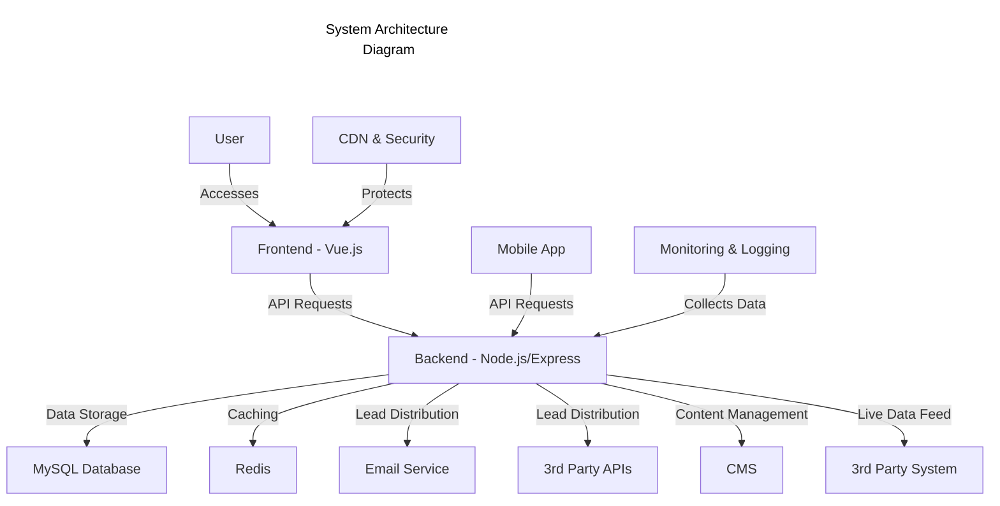

# Lead Generation Website and Mobile App Solution

## 1. Solution

### 1.1 High-Level Architecture

#### System Architecture Diagram

### 1.2 Architecture and Technology Explanation

The proposed architecture for the lead generation website and mobile app is designed to be scalable, secure, and compliant with international data privacy laws. Here's an overview of the key components and technologies:

1. **Frontend (Vue.js)**:
   - We'll use Vue.js for its reactive components and excellent performance.
   - Bootstrap will provide a responsive design framework.
   - Custom CSS will be used for branding and unique design elements.
   - vue-i18n will handle internationalization for multiple languages.

2. **Backend (Node.js with Express.js)**:
   - Node.js and Express.js offer a fast, scalable server environment.
   - Knex.js will serve as our database ORM for efficient database operations.
   - Custom modules will handle integrations with third-party systems.

3. **Database (MySQL)**:
   - MySQL 8.x will store leads, user data, and multilingual content.
   - We'll use encryption (AES-256-GCM) for sensitive data to ensure compliance with privacy laws.

4. **Caching (Redis)**:
   - Redis will cache API responses and frequently accessed data to improve performance.

5. **Content Management System (CMS)**:
   - We'll implement a custom CMS using Node.js and Vue.js for managing multilingual content.
   - This will support structured schema data and social meta data for SEO optimization.

6. **Security and Compliance**:
   - Cloudflare will provide DDoS protection and additional caching.
   - We'll implement OWASP security best practices to protect against common vulnerabilities.
   - The system will be designed to comply with GDPR and local data privacy laws.

7. **Monitoring and Logging**:
   - The ELK Stack (Elasticsearch, Logstash, Kibana) will manage logs and provide insights.
   - Prometheus and Grafana will handle metrics collection and alerting.

8. **Mobile App**:
   - The mobile app will be developed using native technologies (Swift for iOS, Kotlin for Android) to leverage device and OS accessibility features.
   - It will share the same backend as the web application for consistency.

This architecture ensures a robust, scalable solution that can handle multilingual support, secure lead capture and distribution, and integration with third-party systems while maintaining high performance and compliance with accessibility standards.

### 1.3 Non-Technical Explanation

Our lead generation solution is designed to help capture and manage potential customer information across 10 different countries. Here's what makes it special:

1. **User-Friendly Website and App**: We're creating a website that works smoothly on computers, tablets, and phones. We're also developing a mobile app for even easier access.

2. **Speaks Many Languages**: Visitors can use the site in their preferred language, making it accessible to people from different countries.

3. **Smart Lead Capture**: When someone shows interest, their information is securely collected and sent to the right team or system, depending on what they're interested in and where they're from. Additionally, the source of the lead (e.g., campaign page, social media, or ads) is stored with the submitted form to help us understand and optimize our marketing efforts.

4. **Always Up-to-Date**: The website will always show the latest information by connecting with other important systems in real-time.

5. **Easy to Manage**: We're including a simple system that allows easy updates to website content without needing technical skills.

6. **Works for Everyone**: The website and app are designed to be usable by everyone, including people with disabilities, meeting international accessibility standards.

7. **Fast and Secure**: We're using advanced technology to make the website load quickly and protect both visitor information and our system from potential threats.

8. **Follows the Rules**: Our system is designed to comply with data protection laws in all the countries where it will be used.

9. **Keeps Getting Better**: We'll be constantly monitoring how the system is performing and making improvements based on real usage data and feedback.

### 1.4 Risks and Threat Modeling

1. **Data Privacy Compliance**:
   - Risk: Failure to comply with varying data protection laws across 10 countries.
   - Mitigation: 
     - Implement strict data handling processes and encryption.
     - Conduct regular privacy audits.
     - Use country-specific data storage where necessary.
     - Stay updated on changing regulations.

2. **Third-Party Integration Failures**:
   - Risk: Disruptions in lead capture or data feed if third-party systems fail.
   - Mitigation:
     - Implement robust error handling and retry mechanisms.
     - Develop a fallback local storage system for leads.
     - Set up monitoring for integration health.

3. **Performance Under Load**:
   - Risk: System slowdown during high-traffic periods.
   - Mitigation:
     - Implement load balancing and caching strategies.
     - Use cloud services with auto-scaling capabilities.
     - Conduct regular load testing and performance optimization.

4. **Security Vulnerabilities**:
   - Risk: Potential for data breaches or unauthorized access.
   - Mitigation:
     - Regular security audits and penetration testing.
     - Implement OWASP security best practices.
     - Keep all systems and dependencies up-to-date.
     - Use secure coding practices and conduct code reviews.

5. **Accessibility Compliance**:
   - Risk: Failing to meet WCAG 2.2 AA standards across all pages and features.
   - Mitigation:
     - Conduct regular accessibility audits.
     - Integrate accessibility testing into the development process.
     - Provide training to developers on accessibility best practices.

6. **Mobile App Store Rejection**:
   - Risk: Delay in launch due to non-compliance with app store guidelines.
   - Mitigation:
     - Thoroughly review and adhere to app store guidelines during development.
     - Conduct pre-submission testing on multiple devices.
     - Plan for potential revision cycles in the project timeline.

By addressing these risks proactively, we can ensure a more robust, secure, and compliant lead generation system that meets the needs of users across multiple countries.
