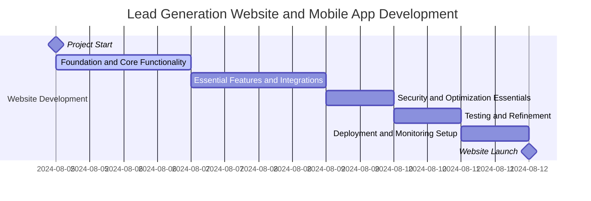
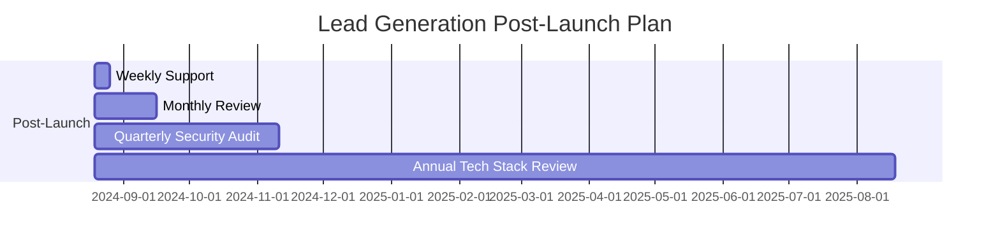
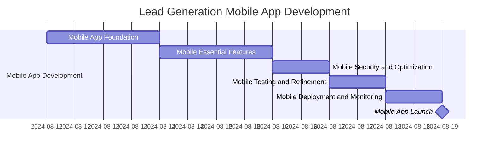

# Project Brief

### Project Objective
Develop a responsive, multilingual lead generation website compliant with WCAG2.2AA standards, optimized for Google Lighthouse metrics, and adhering to security and data privacy regulations. The project should be completed within one week (48 hours of development time). Phase 2 will focus on developing a mobile app that leverages the base technology stack and ensures device and OS accessibility features.

### Technical Stack 

#### Frontend:
- **Framework**: Vue.js
- **UI Framework**: Bootstrap
- **Styling**: Custom CSS for site colors, button styles, and graphics
- **Internationalization**: vue-i18n for multilingual support
- **Mobile Experience**: Leverage device and OS accessibility features

#### Backend:
- **Server**: Node.js with Express.js
- **Database ORM**: Knex.js
- **Database**: MySQL 8.x
- **Database Management**: phpMyAdmin
- **Environment**: Local Docker setup for Node.js, Express.js, Knex, and MySQL

#### Data Storage & Caching:
- **Primary Database**: MySQL for leads and multilingual content
- **Caching**: Redis for API response caching

#### Lead Management:
- **API Integration**: Custom Node.js modules for 3rd party system integration
- **Email Service**: Node Mailer for email-based lead delivery
- **Encryption**: AES-256-GCM for secure data transmission

#### Security & Compliance:
- **DDoS Protection & Caching**: Cloudflare
- **Application Security**: OWASP Security Best Practices
- **Compliance**: GDPR and local data privacy laws

#### Monitoring & Logging:
- **Log Management**: ELK Stack (Elasticsearch, Logstash, Kibana)
- **Metrics & Alerting**: Prometheus & Grafana

## Development Timeline

### Week Overview:
- Focus on core lead generation functionality
- Prioritize essential features
- Allow for flexible task allocation based on progress and challenges

#### Day 1-2: Foundation and Core Functionality (16 hours)
- **Backend Developer (8 hours)**:
  - Set up development environment (3 hours)
    - Configure Docker with essential services (Node.js, MySQL)
    - Initialize Git repository
  - Develop basic API for lead capture (5 hours)
    - Create endpoints for lead submission
    - Implement basic data validation
    - Set up database operations with Knex.js

- **Frontend Developer (8 hours)**:
  - Set up Vue.js project (3 hours)
    - Initialize Vue.js with essential plugins
    - Set up basic routing
  - Develop lead capture form (5 hours)
    - Create form component
    - Implement client-side validation
    - Integrate with backend API

#### Day 3-4: Essential Features and Integrations (16 hours)
- **Backend Developer (8 hours)**:
  - Implement lead storage and basic email notification (4 hours)
    - Set up secure lead storage in MySQL
    - Implement a simple email notification system
  - Basic integration with one key third-party system (4 hours)
    - Choose the most critical integration (e.g., CRM)
    - Implement basic data sync

- **Frontend Developer (8 hours)**:
  - Implement basic multilingual support (4 hours)
    - Set up vue-i18n with essential translations
    - Create language switcher
  - Develop simple content management interface (4 hours)
    - Create basic CRUD operations for lead-generation content
    - Implement a simple admin area

#### Day 5: Security and Optimization Essentials (8 hours)
- **Both Developers (4 hours each)**:
  - Implement critical security measures (3 hours)
    - Set up basic OWASP security practices
    - Implement HTTPS
  - Basic performance optimization (1 hour)
    - Optimize critical rendering path
    - Implement basic caching

#### Day 6: Testing and Refinement (8 hours)
- **Both Developers (4 hours each)**:
  - Conduct thorough testing of core functionality (3 hours)
    - Test lead capture process end-to-end
    - Verify data integrity and security
  - Refinement and bug fixes (1 hour)
    - Address critical issues found during testing

#### Day 7: Deployment and Monitoring Setup (8 hours)
- **Both Developers (4 hours each)**:
  - Deploy to production environment (2 hours)
    - Set up a production server
    - Deploy and verify core functionality
  - Set up basic monitoring (1 hour)
    - Implement error logging
    - Set up basic performance monitoring
  - Final checks and go-live preparation (1 hour)
    - Verify all critical paths are working
    - Prepare for launch

## Phase 2: Mobile App Development (Timeline to be determined)
### Mobile Developer:
- Set up mobile project environment
  - Configure mobile development environment (iOS/Android)
  - Initialize Git repository for mobile app
- Develop mobile app (Timeline to be determined)
  - Integrate with existing backend APIs
  - Implement device and OS accessibility features
  - Ensure compliance with mobile app store guidelines

## Post-Launch Plan

- **Weekly Support Hours**:
  - Allocate 10 hours per week for ongoing support and maintenance
  - Distribution: 6 hours for bug fixes and minor enhancements, 4 hours for monitoring and performance optimization
- **Monthly Review and Planning**:
  - Conduct a monthly review of website performance and lead generation effectiveness
  - Plan feature updates based on gathered data and stakeholder feedback
- **Quarterly Security Audit**:
  - Perform a comprehensive security audit every three months
  - Update dependencies and address any newly discovered vulnerabilities
- **Annual Technology Stack Review**:
  - Evaluate the current technology stack against emerging technologies and industry best practices
  - Propose and plan any necessary major upgrades or migrations

## Server Considerations
### Hosting Options:
- **Cloud Hosting (Recommended)**: AWS, Google Cloud, or Digital Ocean
  - Pros: Scalability, reliability, integrated services
  - Cons: Can be more complex to set up, potential for higher costs if not managed well
- **Dedicated Hosting**:
  - Pros: Full control, potentially better performance
  - Cons: Higher upfront cost, requires more maintenance

### Server Specifications:
- For initial launch:
  - 2 vCPUs
  - 4 GB RAM
  - 50 GB SSD storage
- Scale up based on traffic and performance metrics

### Load Balancing:
- Implement load balancing for improved performance and reliability
- Consider using the cloud provider's built-in load-balancing services

### Backup and Disaster Recovery:
- Daily automated backups
- Implement a disaster recovery plan with a recovery time objective (RTO) of 4 hours

### Monitoring and Alerting:
- Set up comprehensive monitoring for server health, application performance, and lead generation metrics
- Configure alerts for critical issues (e.g., server down, abnormal lead submission patterns)

## Key Assumptions
1. **Stakeholder Availability**:
  - Assumption: Key stakeholders will be available for timely feedback and approvals throughout the development process
  - Mitigation: Establish clear communication channels and schedule regular check-ins
2. **Resource Availability**:
  - Assumption: Dedicated frontend and backend developers are available full-time for the project duration
  - Mitigation: Have a contingency plan for bringing in additional resources if needed
3. **Third-party API Stability**:
  - Assumption: Third-party APIs (CRM, email service, etc.) will remain stable and accessible
  - Mitigation: Implement robust error handling and fallback mechanisms
4. **Data Privacy Regulations**:
  - Assumption: No significant changes in data privacy regulations during the initial development phase
  - Mitigation: Stay informed about upcoming regulations and design the system with flexibility for future compliance needs
5. **Traffic Projections**:
  - Assumption: Initial traffic will not exceed 10,000 unique visitors per day
  - Mitigation: Design the system architecture to easily scale and monitor traffic closely after launch
6. **Content Availability**:
  - Assumption: Multilingual content will be provided by the client for supported languages
  - Mitigation: Provide a content template and guidelines to the client early in the process
7. **Browser Support**:
  - Assumption: The website needs to support the latest versions of Chrome, Firefox, Safari, and Edge
  - Mitigation: Implement cross-browser testing as part of the development process

## Risk Management
1. **Data Privacy Compliance**:
  - Conduct weekly audits of data handling processes
  - Implement data minimization principles
  - Set up automated data retention policies
2. **Integration Failures**:
  - Implement robust error handling and retry mechanisms
  - Set up monitoring for integration health
  - Develop a fallback lead storage system
3. **Performance Under Load**:
  - Conduct load testing using Apache JMeter
  - Implement auto-scaling policies in cloud infrastructure
  - Optimize database queries and add necessary indexes
4. **Security Vulnerabilities**:
  - Conduct regular penetration testing
  - Implement automated security scans in CI/CD pipeline
  - Establish a responsible disclosure program

## Conclusion
This plan outlines the development of a lead generation website within a one-week timeframe, focusing on essential features to deliver a functional, secure, and scalable solution. It includes provisions for multilingual support, ongoing maintenance, server setup, and risk management. Following the launch, we will improve and optimize the website based on performance data and user feedback. Regular reviews and audits will ensure that the website remains effective, secure, and compliant with evolving regulations.

## Phase 2: Mobile App Development Timeline 
_(draft timeline as timings to be confirmed after initial launch)_

  
### Objective: 
Develop a mobile app leveraging the existing backend infrastructure, ensuring device and OS accessibility features.

### Week Overview:
- Focus on core mobile app functionality
- Prioritize essential features
- Allow for flexible task allocation based on progress and challenges

#### Day 1-2: Foundation and Core Functionality (16 hours)
- **Mobile Developer (8 hours)**:
  - Set up mobile development environment (4 hours)
    - Configure development environment for iOS/Android
    - Initialize Git repository for mobile app
  - Develop basic mobile app structure (4 hours)
    - Create basic navigation and UI components

#### Day 3-4: Essential Features and Integrations (16 hours)
- **Mobile Developer (8 hours)**:
  - Integrate with existing backend APIs (8 hours)
    - Implement lead capture functionality
    - Sync with backend for multilingual support

#### Day 5: Security and Optimization Essentials (8 hours)
- **Mobile Developer (8 hours)**:
  - Implement critical security measures (4 hours)
    - Ensure data encryption during transmission
    - Implement authentication mechanisms
  - Optimize mobile app performance (4 hours)
    - Optimize rendering and loading times
    - Ensure app responsiveness

#### Day 6: Testing and Refinement (8 hours)
- **Mobile Developer (8 hours)**:
  - Conduct thorough testing of core functionality (4 hours)
    - Test lead capture process end-to-end
    - Verify data integrity and security
  - Refinement and bug fixes (4 hours)
    - Address critical issues found during testing

#### Day 7: Deployment and Monitoring Setup (8 hours)
- **Mobile Developer (8 hours)**:
  - Deploy to app stores (4 hours)
    - Prepare app store listings
    - Submit for review and approval
  - Set up basic monitoring (4 hours)
    - Implement crash reporting
    - Set up user analytics
